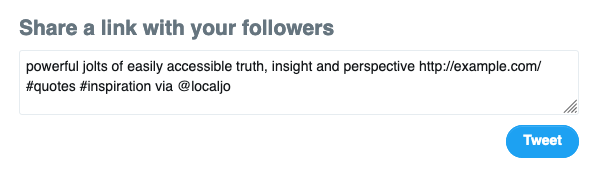

# `quotable-toolbar` 📢

> A library to add Medium-like share menu to selected text and quotes




[](https://www.npmjs.com/package/quotable-toolbar)

Quotable allows you to easily add a contextual popup to your web page for sharing selected text and quotes on Twitter (and soon, other networks).

## Install

```bash
yarn add quotable-toolbar
```

## Usage

Assuming an html page with a structure similar to this;

```html
<div id="blog-container">
  <p>...</p>
  <blockquote>...</blockquote>
  <blockquote class="is-quotable">...</blockquote>
  <blockquote class="not-quotable">...</blockquote>
  <p>...</p>
  <blockquote>
    <p>...</p>
    <p>...</p>
  </blockquote>
  <p>...</p>
</div>
```

You can activate Quotable like this;

```js
import Quotable from 'quotable-toolbar';

window.addEventListener('DOMContentLoaded', () => {
  const quotableToolbar = new Quotable({
    selector: `#blog-container`, // Wrapping element to activate Quotable on
    isActive: {
      blockquotes: true, // Whether to add Quotable links to blockquotes
      textSelection: true, // Whether to activate text selection popup
      include: ['.is-quotable'], // Blockquotes to always add links to
      exclude: ['.not-quotable'], // Blockquotes to never add links to
    },
    url: window.location.href, // URL to share, should be cannonical
    twitter: {
      via: 'JoFromAkron', // Twitter account to @
      related: 'JoFromAkron', // Twitter account to suggest after sharing
      hashtags: ['quotable', 'typescript'], // Hashtags to add to tweet
    },
  });
  quotableToolbar.activate();
});
```

## Features

Quotable has two separate features you can activate, 1) add sharing links to blockquotes and 2) add a sharing link popup on text selection.

### Blockquotes

Quotable will search for every blockquote in the container you select, and append a sharing link. If the blockquote contains paragraphs, the sharing link will be appended to each paragraph. Quotable also wraps the text content of the paragraph or blockquote with a span, used to highlight the text when the sharing link is hovered. You can also selectively add the sharing link to blockquotes by setting `isActive.blockquotes: false` and passing an array to `include` of selectors for elements you want to add sharing link to. Alternatively, you can selectively deactivate the sharing link when `isActive.blockquotes: true` by passing an array to `exclude` of selectors for the elements you _don't_ want to add a sharing link to.

### Text Selection

Quotable adds a popup for every text selection within the container you select. You can disable this with `isActive.textSelection: false`

### Sharing Links

The `url` option determines which url will be shared, when the user clicks a sharing link. You can use `window.location.href`, but if that's not necessarily the canonical url you want people to share, you should set this manually with that value.

Right now, Quotable has support for a link to share content on Twitter. You can configure Twitter sharing options with the `twitter` options object. In the future, support will be added for other networks (Facebook, Reddit, Hacker News, etc), and each option will have it's own settings key in the options object.
